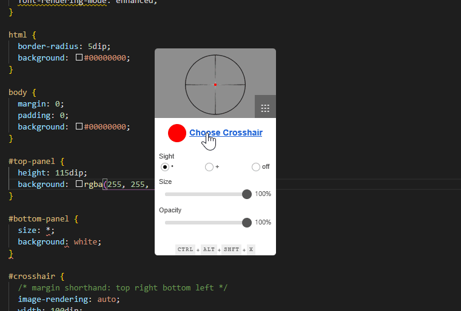

# Crossover Sciter

A [Sciter](https://sciter.com) clone of [this](https://github.com/lacymorrow/crossover) Electron application.  The images were copied from that respository.

## Preview

## Usage

On Windows, run [Sciter](https://github.com/c-smile/sciter-sdk/blob/master/bin.win/x32/scapp.exe) inside this folder.

On Mac and Linux, the corresponding binary can be found under `bin.osx` and `bin.lnx`, respectively.

## To-Do

- [ ] Close Button
- [ ] About Dialog
- [ ] Shortcut Keys
- [ ] Hide Settings
- [ ] Click-Through
- [ ] Fulfill Sciter License Requirements

## Legal

This program requires Sciter to run, and according to the [Sciter license](https://github.com/c-smile/sciter-sdk/blob/master/license.htm):

> 
Your application shall include link to Terra Informatica site in &quot;About&quot; dialog or similar place in your application. Text of the link: This Application (or Component) uses Sciter Engine (<a href="http://sciter.com">http://sciter.com/</a>), copyright Terra Informatica Software, Inc.

> 
We will be delighted (but not demand) if you will place link to <a href="http://sciter.com">http://sciter.com/</a> on the web page of your product using the Sciter.

This has not been implemented yet.